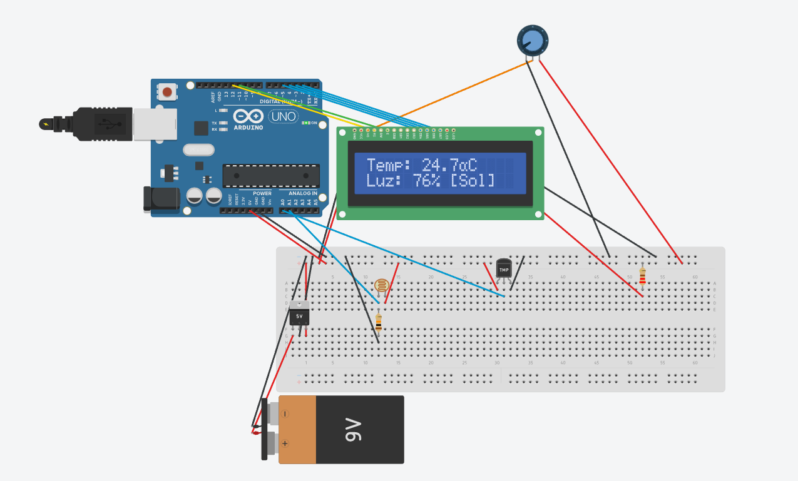

## 📌 Características
- Lectura analógica de temperatura mediante sensor **TMP36**.
- Medición de luz ambiental utilizando fotorresistencia **LDR**.
- Despliegue de datos dinámico en pantalla **LCD 16x2**.
- Indicador visual de estado meteorológico (Sol, Nublado, Noche).
- Salida de métricas por puerto Serial.

## 🛠️ Requisitos de Hardware (Simulado)
- Arduino Uno R3
- Pantalla LCD 16x2
- Sensor de Temperatura TMP36
- Fotoresistencia (LDR)
- Potenciómetro $10k\Omega$
- Resistencia $220\Omega$ y $10k\Omega$

## 🚀 Probar en Tinkercad
Puedes interactuar con la simulación directamente desde Tinkercad ajustando el deslizador de temperatura del TMP36 o la luminosidad de la LDR.
